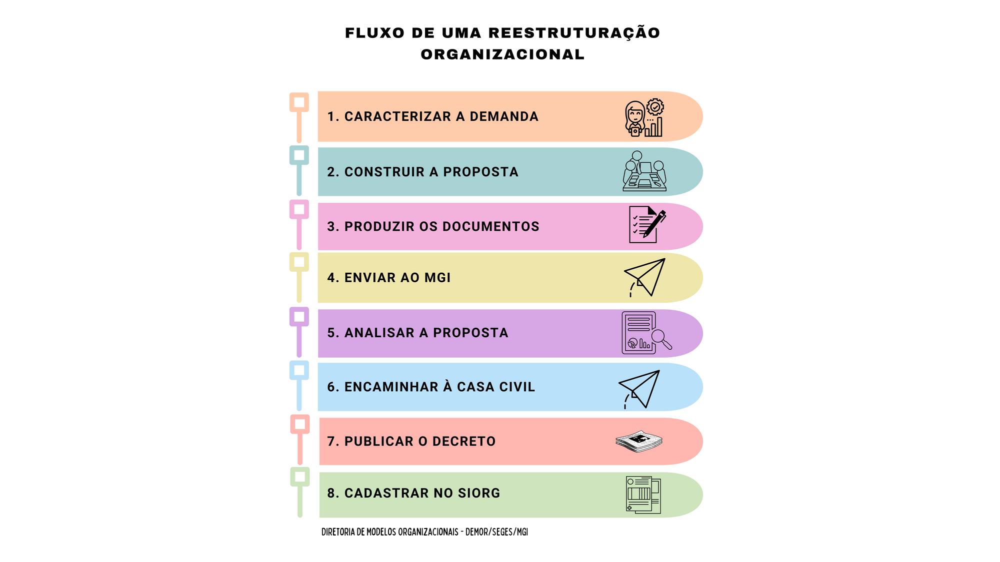

Contextualização
================

No contexto da necessidade de ajuste fiscal, intensificado a partir de 2015, o Poder Executivo Federal tem se empenhado em reduzir despesas com cargos em comissão e funções de confiança, profissionalizar e modernizar a gestão pública [#]_.

Sobre o banner
Veja o :ref:`banner_inicio` ou :numref:`banner_inicio` para mais detalhes .

No atual governo foram robustecidas as diretrizes que orientam os processos de fortalecimento da capacidade institucional nas estruturas organizacionais, dentre as quais destacam-se aquelas com foco na organização da ação governamental por programas, eliminação de superposições e fragmentações das ações, aumento da eficiência, eficácia e efetividade do gasto público e da ação administrativa, racionalização de níveis hierárquicos e aumento da amplitude de comando, orientação para as prioridades de governo e alinhamento das medidas propostas com as competências da organização e os resultados pretendidos [#]_.

Como resultado dessa diretriz foram publicadas, dentre outros atos, a Medida Provisória nº 870, de 1º de janeiro de 2019, os Decretos de Estruturas Regimentais dos Ministérios e dos órgãos da Presidência da República; o Decreto nº 9.725, de 12 de março de 2019, que reduz 21.000 cargos em comissão e funções de confiança e limita a ocupação, a concessão ou a utilização de gratificações; o Decreto nº 9.727, de 15 de março de 2019, que dispõe sobre os critérios, o perfil profissional e os procedimentos gerais a serem observados para a ocupação dos cargos em comissão do Grupo-Direção e Assessoramento Superiores - DAS e das Funções Comissionadas do Poder Executivo – FCPE; o Decreto nº 9.739, de 29 de março de 2019, que estabelece medidas de eficiência organizacional para o aprimoramento da Administração Pública federal direta, autárquica e fundacional e estabelece normas sobre concursos públicos e dispõe sobre o Sistema de Organização e Inovação Institucional do Governo Federal – SIORG; e o Decreto nº 9.754, de 11 de abril de 2019, que extingue 12.315 cargos efetivos vagos e mais 916 que vierem a vagar dos quadros de pessoal da Administração Pública federal.

Primeira Hierarquia
-------------------

Como orientação geral é importante que quando detectada a necessidade de atualização de estruturas regimentais, deve ser perseguido o aprimoramento do desenho organizacional para o alcance das metas estabelecidas e melhoria do desempenho institucional, com foco no cidadão-usuário dos serviços públicos :cite:`teste3`.

Segunda Hierarquia 
++++++++++++++++++

Terceira Hierarquia
^^^^^^^^^^^^^^^^^^^

Este documento mostra o processo descrito na :numref:`figura-fluxo`.

Veja o :ref:`figura-fluxo` ou :numref:`figura-fluxo` para mais detalhes :cite:`teste1`.

Para tanto as unidades deverão ter, no mínimo, um objetivo estratégico associado as suas competências e sob sua responsabilidade, sendo que as demais estruturas de linha dos órgãos e entidades da administração direta ou indireta deverão desenvolver atividades vinculadas aos objetivos de contribuição de seus níveis superiores. Nas propostas de fortalecimento é importante observar o quantitativo de servidores alocados em área finalística e área-meio, bem como evitar que haja mais de quatro níveis hierárquicos entre as unidades de linha. Recomenda-se que a proporção de profissionais por cargo de chefia não deverá ser inferior a sete servidores.

   Diagrama de fluxo de geração de documentação com Sphinx.

Sobre o banner
Veja o :ref:`banner_inicio` ou :numref:`banner_inicio` para mais detalhes.

Tabela de teste com texto:

.. list-table::
   :header-rows: 1
   :widths: 15 35

   - * Ícone
     * Descrição
   - * *Visualização detalhada*
     * Possibilita uma visualização mais detalhada dos processos na tela. O usuário poderá configurar essa opção clicando no link “Visualização detalhada” e, em seguida, no link “Configurar nível de detalhe”.
   - * *Configurar nível de detalhe*
     * Esse link surge quando o usuário clica em “Visualização detalhada”. Ele permite a configuração do nível de detalhe a ser exibido em tela. O usuário poderá selecionar uma das seguintes opções a serem apresentadas na tela: Atribuição, Anotação, Tipo de processo, Especificação, Interessados, Observação, Controle de Prazo, Para Devolver, Aguardando Retorno, Última Movimentação na Unidade e Marcadores.

.. figure:: ../_static/images/banner_inicial.png
   :alt: Um banner inicial
   :align: center
   :name: banner_inicio

   banner da tela inicial

Sobre o banner
Veja o :ref:`banner_inicio` ou :numref:`banner_inicio` para mais detalhes.

.. [#] A estrutura pode ser funcional, matricial ou orientada por processos, conforme o modelo de gestão adotado.
.. [#] Teste de chefia.

